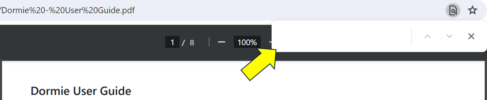

# Dormie User Guide

## Purpose of Dormie
Dormie is an application developed for college students living in dorms. It helps them connect with their dorm mates in a simple way. With Dormie, they can easily see when their friends are free, and keep track of their important dates and contact details. It makes organising social events less stressful and helps students stay connected with each other.
<!-- * Table of Contents -->
<page-nav-print />

## Using This User Guide
### Command Format
| Type                   | What it means                                                                                                                                                                                                                                                                                                                                                                               |
|------------------------|---------------------------------------------------------------------------------------------------------------------------------------------------------------------------------------------------------------------------------------------------------------------------------------------------------------------------------------------------------------------------------------------|
| `Code Block`           | A line of command that can be entered into Dormie's input field.   e.g., `add n/John Doe p/98765432 e/johnd@example.com r/sw-01-01 t/johnDoe b/12/12/2000 ft/Mon:1300-1400`.                                                                                                                                                                                                             |
| Words in `UPPER_CASE`  | The parameters to be supplied by the user.   e.g. in `add n/NAME`, `NAME` is a parameter which can be used as `add n/John Doe`.                                                                                                                                                                                                                                                          |
| \[optionalField\]      | Items in square brackets are optional.   e.g `n/NAME [ft/FREETIMETAG]` can be used as `n/John Doe ft/Mon:1300-1400` or as `n/John Doe`.                                                                                                                                                                                                                                                  |
| ...                    | Ellipsis mean that the field can be used 1, or more times in a single command.   e.g `ft/FREETIMETAG...` means that the following commands are allowed `ft/Mon:1300-1400`, `ft/Mon:1300-1400 ft/Tue:1400-1600`.   e.g `[ft/FREETIMETAG]...` means that the following parameters are allowed `ft/Mon:1300-1400`, `ft/Mon:1300-1400 ft/Tue:1400-1600`, or not specifying for free time. |

### Searching for Keywords (Ctrl-F)
1. Press the Ctrl + F keys on your keyboard.
2. A search bar or dialog box should appear on your screen. A screenshot is shown below.
   
3. Type the keyword or phrase you want to search for in the search bar and press enter.

### Additional Notes
- **Order of Parameters**   Parameters can be in any order.   e.g. if the command specifies `n/NAME p/PHONE_NUMBER`, `p/PHONE_NUMBER n/NAME` is also acceptable.
- **Extraneous Parameters**   Extraneous parameters for commands that do not take in parameters (such as `list`) will be ignored.   e.g. if the command specifies `list 123`, it will be interpreted as `list`.
- **Copying and Pasting from this User Guide**   If you are using a PDF version of this document, be careful when copying and pasting commands that span multiple lines as space characters surrounding line-breaks may be omitted when copied over to the application.
- **Command keywords are case-sensitive**   Command keywords for the commands should be exactly the same as demonstration, or else Dormie would not recognize it.
  e.g. `add` is the command keyword in the add command, where `Add` or `ADD` will not work.
---

## Command summary

| Action                | Format, Examples                                                                                                                                                  |
|-----------------------|-------------------------------------------------------------------------------------------------------------------------------------------------------------------|
| **Add**               | `add n/NAME p/PHONE_NUMBER [e/EMAIL] [r/ROOM_NUMBER] [t/TELEGRAM_HANDLE] [b/BIRTHDAY] [d/DORM_TAG] [ft/FREE_TIME_TAG]...`   e.g., `add n/Alice Lim p/91234567` |
| **Add Free Time**     | `addTime INDEX ft/TIME`  e.g., `addTime 1 ft/Mon:0800-1200`                                                                                                    |
| **Clear**             | `clear`                                                                                                                                                           |
| **Delete**            | `delete INDEX`  e.g., `delete 3`                                                                                                                               |
| **Delete Free Time**  | `deleteTime INDEX ft/TIME`  e.g., `deleteTime 1 ft/Mon:0800-1200`                                                                                              |
| **Edit**              | `edit INDEX [n/NAME] [p/PHONE_NUMBER] [e/EMAIL] [r/ROOM_NUMBER] [t/TELEGRAM] [d/DORM_TAG] [ft/FREE_TIME_TAG]...`  e.g.,`edit 1 n/Alex p/98765432`              |
| **Exit**              | `exit`                                                                                                                                                            |
| **Find**              | `find KEYWORD`  e.g., `find Alice`   *only searches the name                                                                                                |
| **Help**              | `help`                                                                                                                                                            |
| **List**              | `list`                                                                                                                                                            |
| **Who Is Free**       | `whoisfree TIME`  e.g., `whoisfree Mon:0800`                                                                                                                   |

---

## Format for Fields
| Field            | Format                                                                                                                                                                                                                                                                                                                                                                                                                                                                                                                                                                                                                                                                                                                |
|------------------|-----------------------------------------------------------------------------------------------------------------------------------------------------------------------------------------------------------------------------------------------------------------------------------------------------------------------------------------------------------------------------------------------------------------------------------------------------------------------------------------------------------------------------------------------------------------------------------------------------------------------------------------------------------------------------------------------------------------------|
| Name             | Can only contain alphanumeric characters and spaces in between.   e.g. `Dormie Tan`.                                                                                                                                                                                                                                                                                                                                                                                                                                                                                                                                                                                                                               |
| Phone Number     | Must contain only numbers, be 8 digits long, and must start with an 8 or 9.  All mobile numbers are assumed to be Singapore numbers, with an area code of (+65).   e.g. `91234567`.                                                                                                                                                                                                                                                                                                                                                                                                                                                                                                                             |
| Email            | Must be of the format local-part@domain and adhere to the following constraints:  1. The local-part should only contain alphanumeric characters and these special characters, excluding the parentheses, (.). The local-part may not start or end with any special characters.  2. This is followed by a '@' and then a domain name. The domain name is made up of domain labels separated by periods.  The domain name must:      - end with a domain label at least 2 characters long      - have each domain label start and end with alphanumeric characters      - have each domain label consist of alphanumeric characters, separated only by periods, if any.   eg:`dormie@example.com`. |
| Room Number      | {block}-{floor}-{room number}, where block and room number are at least 2 alphanumeric characters and floor is strictly 2 alphanumeric characters.   eg:`nw-12-12`.                                                                                                                                                                                                                                                                                                                                                                                                                                                                                                                                                |
| Telegram Handle  | Can only contain case-insensitive letters A-Z, digits 0-9, and underscores, with a length between 5 and 32 characters, and it **should not** be blank.   Note: Do not include the `@` symbol in the input.   e.g `dormie_123`.                                                                                                                                                                                                                                                                                                                                                                                                                                                                                  |
| Birthday         | `dd/MM/yyyy`, `dd-MM-yyyy`, `yyyy-MM-dd`, `yyyy/MM/dd`.   `dd` is the date of the month, `MM` is the month, `YYYY` is the year.   e.g. **30/01/2024**, **30-01-2024**, **2024-01-30**, **2024/01/30** all represent 30 January 2024.                                                                                                                                                                                                                                                                                                                                                                                                                                                                            |
| Dorm Tag         | Any non-empty String that contains at least one non-whitespace character.   eg. `PGPR`.                                                                                                                                                                                                                                                                                                                                                                                                                                                                                                                                                                                                                            |
| Free Time Tag    | `DDD:HHmm-HHmm`.   `DDD` is from Mon-Sun, `HHmm` is 24 hour time format.   e.g. **Mon:1300-1400**.                                                                                                                                                                                                                                                                                                                                                                                                                                                                                                                                                                                                              |

---

## Quick start

1. Ensure you have Java `11` or above installed in your Computer.

   - MacOS: [Java 11](https://www.oracle.com/sg/java/technologies/javase/jdk11-archive-downloads.html)
   - Windows: [Java 11](https://www.azul.com/downloads/?version=java-11-lts&os=macos&architecture=arm-64-bit&package=jdk-fx#zulu)

1. Download the latest `dormie.jar` from [here](https://github.com/AY2324S2-CS2103T-F11-4/tp/releases).

1. Create a new _Home Folder_ you want Dormie to permanently reside in.

   - Move Dormie into the _Home Folder_
   - This is where Dormie and all it's supporting data will be stored

1. Open a command terminal (`Terminal` for MacOS, or `Windows Terminal` for Windows)

   - MacOS:
      1. Right click the _Home Folder_
      2. Left click `Services`
      3. Then, click `New Terminal at Folder`
   - Windows:
      1. Navigate into the _Home Folder_
      2. Right click anywhere inside the _Home Folder_
      3. Left click `Open in Windows Terminal`

1. Paste this Command into the new terminal window `java -jar dormie.jar` and press enter. 
   A GUI similar to the below should appear in a few seconds. Note how the app contains some sample data. 
   

1. Type the command in the command box and press Enter to execute it. 
   Quick Tutorial:

   - `add n/John Doe p/98765432 ` : Adds a contact named `John Doe` to Dormie with the specified phone number

   - `find John` : Finds a contact with `John` in his name.

   - `delete 1` : Deletes the 1st contact shown in the current list.

   - `list` : Lists all contacts again.

1. Refer to [Features](#features) below for details of each command
   or to [Command Summary](#command-summary) for a summary of the commands.

---

## Features
### Adding a person: `add`

Creates a new contact for a person.

Format: `add n/NAME p/PHONE_NUMBER [e/EMAIL] [r/ROOM_NUMBER] [t/TELEGRAM_HANDLE] [b/BIRTHDAY] [d/DORM_TAG] [ft/FREE_TIME_TAG]...`

Examples:
- Adding a person with only mandatory fields:   `add n/Alice Lim p/91234567`.
- Adding a person with all mandatory and some optional fields:   `add n/John Doe p/98765432 r/sw-01-01 ft/Mon:1300-1400 ft/Tue:1300-1400`.
- Adding a person with all fields:   `add n/Jane Doe p/97826712 e/janed@example.com r/sw-02-02 t/janeDoe b/11/11/2001 d/PGPR ft/Mon:1000-1200 ft/Tue:1300-1400`.

### Adding Free Time Tag : `addTime`
Adds 1 or multiple specified `freeTimeTags`

Format: `addTime INDEX ft/FREE_TIME_TAG...`

Examples:
- Single input: `addTime 1 ft/Mon:1300-1400`
- Multiple input: `addTime 1 ft/Mon:1300-1400 ft/Tue:1300-1400`

Note:
- As this is the first version, there is no functionality to merge overlapping free time tags yet.
- The command will only add the user input free time tags that the specified contact does not have.

### Clearing all persons: `clear`

Clears all person records.

**WARNING!** After clearing all records, you will not be able to undo the action.

### Deleting a person : `delete`

Deletes the specified person from Dormie.

Format: `delete INDEX`

- Deletes the person at the specified INDEX.
- The index refers to the index number shown in the displayed person list.
- The index must be a positive integer. eg. 1, 2, 3

Examples:
- `delete 2` deletes the 2nd person in Dormie.

Note:
- Do **not** include the `+` symbol in your command.

### Deleting Free Time Tag : `deleteTime`
Deletes 1 or multiple specified `freeTimeTags`

Format: `deleteTime INDEX ft/FREE_TIME_TAG...`

Examples:
- Single input: `deleteTime 1 ft/Mon:1300-1400`
- Multiple input: `deleteTime 1 ft/Mon:1300-1400 ft/Tue:1300-1400`

Note:
- As this is the first version, only free time tags that **exactly** match the interval(s) specified will be deleted.
- The command will only delete the user input free time tags that the specified person has.

### Editing a person : `edit`

Edits the specified fields of an existing person in Dormie.

- Edit function will replace the specified field with the new input
- Edits the person at the specified INDEX. The index refers to the index number shown in the displayed person list. The index must be a positive integer. eg. 1, 2, 3
- Existing values will be updated to the input values.
- Minimum 1 field must be specified. eg. `n/NAME` is a field.

Format: `edit INDEX [n/NAME] [p/PHONE_NUMBER] [e/EMAIL] [r/ROOM_NUMBER] [t/TELEGRAM] [d/DORM_TAG] [ft/FREE_TIME_TAG]...`

Examples:
- `edit 1 n/Alex r/01-05-11` Edits the name and room number of the 1st person to be Alex and 05-11 respectively.

### Close Dormie : `exit`

Closes the Dormie application.

### Filter the contact list by name : `find`

View all contacts whose names contain the user input keyword/s.

Format: `find KEYWORD [MORE_KEYWORDS]`
- Command is case-insensitive. eg.`alex` will match `Alex`.
- Order of keywords does not matter. eg.`Yeoh Alex` will match `Alex Yeoh`.
- Only the names are searched.
- Only full words will be matched. eg.`Ale` will not match `Alex`.
- Contacts with names that match at least one keyword will be returned. eg.keyword:`Yeoh` will return `Alex Yeoh`,`Bernice Yeoh`.

Note:
- Every time a `find` command is executed, Dormie displays all matching contacts from the original contact list (i.e., the one before any filtering is applied).
- A common approach to view the original contact list after executing a `find` command is by using the `list` command.

### Provide more detail on existing commands : `help`

Show a link to the User Guide.

### Listing all persons : `list`

List all contacts and their details.

### Checking who is free : `whoisfree`
View all persons that are available on the specified day and time.

Format: `whoisfree DAY:TIME`
- `DAY` is from Mon-Sun
- `TIME` is 24-hour time format

Example:
- `whoisfree Mon:1300`

### Important Note
- No 2 people can share the same `PHONE_NUMBER`, `EMAIL`, or  `TELEGRAM_HANDLE`.
- If `freeTimeTags` are edited, the person's `freeTimeTags` will be replaced with the new set of `freeTimeTags`.
- Example:
   - Let Joe have a `freeTimeTag`:`Mon:1300-1400` and have the index 1:
   - `edit 1 ft/`: Will delete the existing `freeTimeTags`
   - `edit 1 ft/Tue:1300-1400 ft/Wed:1300-1400` Will replace the existing _Monday_ tag with the _Tuesday_ and _Wednesday_ tag.

### Saving the data

Dormie data are saved in the hard disk automatically after any command that changes the data. There is no need to save manually.

### Editing the data file

Dormie data are saved automatically as a JSON file [JAR file location]/data/dormie.json. Advanced users are welcome to update data directly by editing that data file.

<box type="warning" seamless>

Caution:
If your changes to the data file makes its format invalid, Dormie will discard all data and start with an empty data file at the next run. Hence, it is recommended to take a backup of the file before editing it. 
Furthermore, certain edits can cause the Dormie to behave in unexpected ways (e.g., if a value entered is outside the acceptable range). Therefore, edit the data file only if you are confident that you can update it correctly.
</box>

---

## FAQ

**Q**: How do I transfer my data to another Computer? 
**A**: Install the app in the other computer and overwrite the empty data file it creates with the file that contains the data of your previous Dormie home folder.

---

## Known issues

1. **When using multiple screens**, if you move the application to a secondary screen, and later switch to using only the primary screen, the GUI will open off-screen. The remedy is to delete the `preferences.json` file created by the application before running the application again.

--------------------------------------------------------------------------------------------------------------------

## Glossary

| Term                                | Definition, Examples                                                                                                                                                                                                                                                                            |
|-------------------------------------|-------------------------------------------------------------------------------------------------------------------------------------------------------------------------------------------------------------------------------------------------------------------------------------------------|
| **Command**                         | Instruction provided by a user to specify the desired action or change to be performed by an application.                                                                                                                                                                                       |
| **Command Line Interface (CLI)**    | Text-based interface used to interact with the application by typing commands into a command box.                                                                                                                                                                                               |
| **Graphical User Interface (GUI)**  | User interface that allows users to interact with graphical icons and visual indicators, use graphical elements such as windows, buttons, menus, and dialog boxes to facilitate user interaction with the application.                                                                          |
| **JavaScript Object Notation (JSON)** | Lightweight data interchange format that is easy for humans to read and write and easy for machines to parse and generate. JSON is based on key-value pairs and data structures, making it a popular format for representing structured data in web development and other programming contexts. |
| **Web Browser**                     | Software application used to access information on the World Wide Web. Examples include Google Chrome, Mozilla Firefox, and Microsoft Edge.                                                                                                                                                     |
| **Document Viewer** | Software application used to view, read, and interact with documents in various formats, such as PDF, Word, Excel, and PowerPoint files. Examples include Adobe Acrobat Reader, Microsoft Word, and Google Docs. |
| **Java** | General-purpose, class-based, object-oriented programming language designed to have as few implementation dependencies as possible. Java is widely used for developing applications, including desktop, web, and mobile applications. |
| **MacOS** | Operating system developed by Apple Inc. for its Macintosh line of computers. MacOS is known for its user-friendly interface, stability, and security features. |
| **Windows** | Operating system developed by Microsoft Corporation for personal computers. Windows is known for its graphical user interface, multitasking capabilities, and compatibility with a wide range of software applications. |
| **Home Folder** | Main directory or folder where an application is installed or resides. The home folder typically contains the application's executable files, configuration files, and data files. |
| **Terminal** | Command-line interface used to interact with the operating system by typing commands. The terminal allows users to execute commands, run scripts, and perform various system tasks. |
| **Parameter** | Value or variable that is passed to a command or function to specify the desired action or behavior. Parameters are used to customize the behavior of commands and functions based on user input. |
